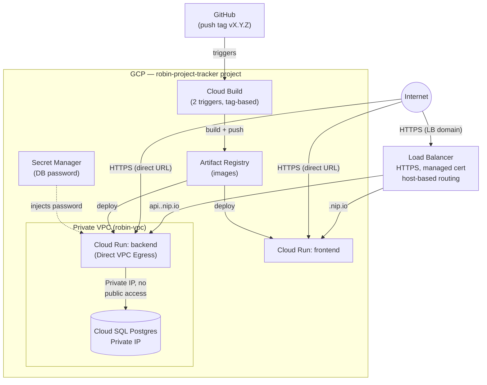

# Project Tracker — DevOps Junior Challenge

A simple full-stack app (frontend + API + database), containerized and
deployed on GCP with Terraform, with CI/CD automatically triggered by
tags.

The app itself — a "Project Tracker" for a software factory managing
projects for several clients — isn't what's being evaluated here: it's
just the vehicle for the infrastructure work.

**Deployed URLs (primary, via Load Balancer):**
- Frontend: https://35.201.99.247.nip.io
- Backend: https://api.35.201.99.247.nip.io

> Frontend and backend live on separate subdomains, both generated from
> the same Load Balancer IP (nip.io automatically resolves any subdomain
> to the IP embedded in it, no DNS setup needed). A single Google-managed
> SSL certificate covers both domains.

Cloud Run's own direct URLs (`*.run.app`, auto-generated by GCP) also
respond, in parallel — a deliberate decision, see the decisions section
below. The backend accepts calls from both paths: its CORS is explicitly
restricted to the list of real origins (the Load Balancer's domain and
the 2 URL variants Cloud Run generates for the frontend), never a
wildcard.

> These URLs are taken down (`terraform destroy`) once the evaluation is
> confirmed. See "Running it locally" to try it without depending on
> them staying up.

---

## Architecture



**Two access paths, on purpose:** both Cloud Run services have
`ingress = ALL`, so they accept traffic both through the Load Balancer
and directly at their `*.run.app` URL. The decision to keep direct access
open (instead of restricting it to only the Load Balancer) was to keep
the URLs shared in the original challenge submission working in parallel
with the new architecture, without breaking anything already delivered.

**Data flow:** the backend is the only component with access to the
database, via **Direct VPC Egress** (no separate connector), and the DB
only has a private IP, with no exposure to the internet.

**CI/CD flow:** a push of tag `vX.Y.Z` triggers the build, push to
Artifact Registry, and deploy to Cloud Run for both services.

---

## Stack

| Layer | Technology |
|---|---|
| Frontend | React + Vite, served in production with nginx |
| Backend | Node.js + Express, `pg` for Postgres |
| Database | Cloud SQL (Postgres 15), private IP |
| Infrastructure | Terraform Cloud (VCS-driven), GCP |
| Compute | Cloud Run (2 services: frontend, backend) |
| Load Balancer | Global HTTPS, host-based routing (subdomains), managed cert (nip.io) |
| CI/CD | Cloud Build, 2 tag-triggered triggers |
| Secrets | Secret Manager (DB password) |

---

## Running it locally

Requires Docker and pnpm (or `corepack enable` to get it via Node 20+).

```bash
git clone https://github.com/willy9461/robin-devops-challenge.git
cd robin-devops-challenge
docker compose up --build
```

This spins up the backend and a local Postgres instance. The frontend
runs separately in dev mode (hot-reload):

```bash
cd frontend
pnpm install
pnpm dev
```

Open `http://localhost:5173`.

---

## Decisions and why

### A single repo, no modules published to an external Registry
The 5 Terraform modules (`networking`, `service-accounts`, `database`,
`cloud-run`, `cloudbuild-trigger`) live as folders inside
`terraform/modules/`, in the same repo as the app. Publishing them to a
module Registry only pays off when several different teams or projects
are going to consume them as an external dependency — here there's a
single consumer (this same repo), so adding that layer would be
complexity without real benefit.

### A single VCS-driven Terraform Cloud workspace
All 5 modules run in a single workspace connected via VCS to the repo.
References between modules (`module.networking.network_id`, etc.)
resolve automatically within the same `apply`, with no need to copy
outputs by hand between separate workspaces.

### A single deploy Service Account
The workspace runs with a single SA (`terraform-deployer`), with the
minimal union of roles each module needs. Since the whole `apply` runs
in a single authenticated session, splitting that identity into several
per-module SAs wouldn't add real isolation (they'd all end up being used
together in the same run) — it would just add more credentials to
manage with no real security gain.

There **are 2 separate runtime SAs** (`app-backend`, `app-frontend`) —
each Cloud Run service runs with its own identity in production, and the
frontend has no role granting access to the database or Secret Manager,
because it never needs them. There, separation does make sense: these
are identities running in production, exposed to real traffic.

### Build SAs separate from runtime SAs
There are also **2 dedicated build SAs** (`build-backend`,
`build-frontend`), distinct from the 2 runtime SAs above. The build SAs
hold the elevated project-level roles a deploy needs (Artifact Registry
writer, Cloud Run Admin, Service Account User) and are the identity that
executes each Cloud Build trigger. The runtime SAs only hold what the
running service actually needs (Cloud SQL client, Secret Manager
accessor for the backend; nothing extra for the frontend) — they never
carry administrative permissions, even though they're the identity a
public-facing service runs as.

### Direct VPC Egress instead of a Serverless VPC Access Connector
The backend reaches the VPC (and from there, Cloud SQL) using Direct VPC
Egress in the Cloud Run service configuration, with no separate
connector. It's the pattern currently recommended by GCP for this use
case: one less resource to provision and maintain, same result.

### Load Balancer with subdomains, CORS explicitly scoped
Frontend and backend sit on **separate subdomains** under the same Load
Balancer (`<ip>.nip.io` for the frontend, `api.<ip>.nip.io` for the
backend) — a single managed certificate covers both domains, and the
`url_map` routes by host. Since these are different origins for the
browser, the backend explicitly restricts its
`Access-Control-Allow-Origin` to the list of real origins — never a
wildcard.

### Keeping direct Cloud Run access enabled
Both services have `ingress = ALL` instead of restricting it to only the
Load Balancer. The reason: the Cloud Run URLs had already been shared as
part of the original challenge submission, and the decision was to keep
them working in parallel with the new architecture, rather than closing
them off. The backend explicitly allows the 3 real origins a frontend
request can come from (the Load Balancer's domain, and the 2 URL
variants Cloud Run auto-generates for the same service) — still no
wildcard, just a longer list of concrete, known origins.

### Tag-triggered CI/CD
The pipeline is triggered by a tag push (`vX.Y.Z`) on a commit already
merged into `main`, rather than on every direct push. It separates
"integrated code" from "published version," giving an explicit checkpoint
before each release.

### Git flow: branch → PR → merge → tag
Every change (app code, each Terraform fix) was made on a separate
branch, with a Pull Request into `main`, and only once that commit was
merged was the tag created that triggers the actual deploy.

### DB password via Secret Manager
The Cloud SQL password is generated with `random_password`, stored in
Secret Manager, and injected into the backend on Cloud Run via
`secret_env_vars` — it's never in plain text in any environment variable
or in the code.

---

## What I'd improve with more time

- **Workload Identity Federation instead of a JSON key:** the deploy SA
  uses a JSON key pasted as a sensitive variable in Terraform Cloud. WIF
  would avoid having any long-lived credential floating around.
- **Auto-apply enabled:** for now every `apply` in Terraform Cloud
  requires manual confirmation, useful while iterating and debugging
  errors; in a mature flow I'd turn it on.
- **Automated tests** (none for now, given the 48h scope) and a test
  step in the CI pipeline before deploy.
- **Cloud SQL backups:** deliberately disabled for this challenge's
  scope; in a real environment I'd enable them.
- **Decouple the tag-triggered Terraform Cloud plan from Cloud Build's
  deploy timing:** both are triggered by the same tag push and can race
  (see the AI usage section below) — with more time I'd add an explicit
  ordering or a check so a late-confirmed Terraform apply can't overwrite
  a Cloud Build deploy that already landed.
- **Consolidate to a single canonical domain:** right now there are 3
  valid origins for the frontend (the Load Balancer's and 2 Cloud Run
  variants) — a deliberate choice to avoid breaking already-shared URLs,
  but in a real project I'd prefer one stable domain from the start.

---

## AI usage

I used Claude (Anthropic) throughout practically the whole build:
designing the backend and frontend, writing the Terraform modules,
debugging real `apply` errors against the GCP API, and organizing the
git flow. I document the most significant points here.

### What I asked it for, step by step
- Generate the backend skeleton and code (Express + Postgres) and the
  frontend (React + Vite) from scratch, including multi-stage
  Dockerfiles.
- Design and write the 5 Terraform modules (networking,
  service-accounts, database, cloud-run, cloudbuild-trigger) and the
  root module connecting them.
- Debug, in real time, every error from the first real `apply` against
  GCP (see cases below) — reading logs, forming hypotheses, verifying
  them against the GCP console before applying a fix.
- Walk me step by step through terminal commands (git, gh CLI, Terraform
  CLI) and through the GCP/Terraform Cloud web console, since I was
  executing everything myself on my machine.

### A decisive prompt
After the first failed `apply`, I shared the error exactly as Terraform
Cloud returned it:

> "Error: Error creating Trigger: googleapi: Error 400: Request contains
> an invalid argument.
> with module.cloudbuild_trigger.google_cloudbuild_trigger.backend
> on modules/cloudbuild-trigger/main.tf line 24, in resource
> "google_cloudbuild_trigger" "backend": [...]"

The API's message didn't carry any more detail about which field exactly
was failing. Sharing the full error, without summarizing or
interpreting it, made it possible to rule out a first hypothesis (a
`location` issue) and then diagnose the real cause by manually recreating
a trigger from the GCP console, which does validate field by field
before sending the request — the console flagged "Service account" as
required, something the API/Terraform never stated explicitly.

### What I did with what it gave me
I used most of the code as-is, after running `terraform validate` before
every real `apply`. When something failed against the real GCP API, I
asked for the specific fix, validated it again, and applied it through
the same branch+PR+tag flow as the rest of the code — I never applied a
fix "blindly" without at least one verifiable hypothesis about the cause.

### Cases where the AI got something wrong or fell short, and how it was solved
These are the 7 real cases, in the order they happened:

**1. pnpm version incompatible with Node.** `packageManager:
pnpm@11.21.0` was pinned in the backend without checking compatibility
with the Dockerfile's base image (`node:20-alpine`). The build failed
inside the container: pnpm 11 requires Node ≥22.13. It was caught from
the Docker build log, and fixed by pinning `pnpm@10.5.2` (the version I
already had locally), compatible with Node 20.

**2. Missing explicit dependency in the `database` module.** The first
real `apply` failed with *"the network doesn't have at least 1 private
services connection"* while creating the Cloud SQL instance. The AI had
written the `database` module without an explicit `depends_on` toward
`networking`. This **passed every prior validation** (syntax, `terraform
validate`, even the `plan` showed "25 to add" with no errors) — it only
surfaced on the real `apply`. Fixed with `depends_on = [module.networking]`
at the module level.

**3. Invalid `location` on the Cloud Build triggers.** The `apply`
failed with a generic API error (*"Error 400: Request contains an
invalid argument"*, no specific detail). The AI had set
`location = var.region`, copying the regional pattern used for the rest
of the resources — but triggers connected via the classic GitHub App
(1st gen) only live at `location = global`. Diagnosed by manually
recreating a test trigger from the GCP console, and fixed by removing
`location`.

**4. Missing explicit `service_account` and `logging` on the triggers.**
After the previous fix, the `apply` kept failing with the same generic
error. Diagnosed again the same way (a manual test trigger in the
console), which revealed a new requirement: the organization requires an
explicit Service Account to run each build (Google changed Cloud Build's
default behavior in mid-2024). After adding `service_account`, a second
related requirement showed up: with a custom SA, you also have to
specify where the build logs go (`options { logging = "CLOUD_LOGGING_ONLY" }`).
Neither requirement showed up in syntax validation or in the `plan`.

The common pattern across cases 1-4: the AI generated code that was
syntactically valid and passed `terraform plan` with no errors, but with
incorrect assumptions about the real behavior of the GCP API.

**5. Race condition between the tag-triggered Terraform Cloud plan and
Cloud Build's deploy.** After adding the Load Balancer, a later `apply`
overwrote a Cloud Build deploy that had just landed. Both processes are
triggered by the same tag push: Terraform Cloud computed its plan almost
instantly, while Cloud Build took a couple of minutes to build and
deploy. By the time I confirmed the `apply` on Terraform Cloud — after
Cloud Build had already finished — Terraform applied the plan it had
computed earlier, and `lifecycle.ignore_changes` on the image field
preserved the value *from that earlier snapshot*, not the one Cloud
Build had just set. Not a code mistake in the same sense as cases 1-4;
it's an architectural side effect of triggering two independent systems
off the same event with no ordering between them. Fixed operationally by
re-pushing a tag once Terraform Cloud's apply had fully settled, so
Cloud Build's redeploy was the last thing to touch Cloud Run.

**6. Name collision when rotating the managed SSL certificate.** Going
from 1 to 2 domains on the certificate, the `apply` failed with
*"resourceInUseByAnotherResource"*. GCP's managed SSL certificates are
immutable — changing their domains means Terraform has to create a new
one and delete the old one. Since both had the same fixed name
(`robin-lb-cert`), Terraform couldn't create the new one first (name
collision), and tried deleting the old one first instead — which failed
because the proxy was still using it. Fixed by deriving the certificate
name from a hash of the domains it covers, so any future domain change
generates a distinct name automatically, allowing
`create_before_destroy` without collision.

**7. `ingress` field not actually reverted after removing the line.**
When reverting the Cloud Run services' ingress restriction, the AI
simply deleted the `ingress = "..."` line from the resource, assuming
that would fall back to the default. The `apply` ran with no error and
reported "Updated," but the real value in GCP stayed **stuck** on the
previous restriction — confirmed by checking the Cloud Run console. The
cause: `ingress` is an `Optional + Computed` field in the Google
provider, and omitting it is interpreted as "stop managing this field"
(keeping whatever GCP already had), not "apply the default." Fixed by
setting the explicit value `ingress = "INGRESS_TRAFFIC_ALL"` instead of
just omitting the line.

The common pattern across cases 5-7: none were catchable by static
validation or the `plan` — all required confirming the real state in the
GCP console after a "successful" `apply` to discover the result wasn't
what was expected.

### A decision made without AI
When it came to creating resources in GCP (project, APIs, Service
Accounts), the AI suggested installing the `gcloud` CLI to speed up
several steps that were going to repeat. I decided not to install it and
to do everything through the GCP web console instead — I didn't want to
add a new tool to my environment just to save a few clicks, preferring a
slower step with no extra dependencies to manage after the challenge.

I also decided, without the AI suggesting it, to switch to pnpm as the
package manager across the whole project — it's the one I prefer to use
— and to keep the repo **private** throughout development, following the
branch+PR flow by discipline instead of with automatic protection, and
making it public only once it was time to submit.

---

## Cleanup after the evaluation

```bash
cd terraform
terraform destroy
```

Will notify once the project is taken down and the URLs stop being
available.
